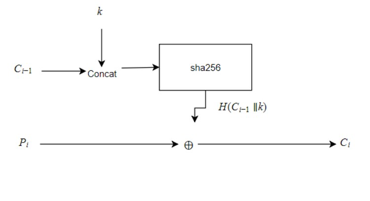

### Joel's Digest Cipher

A 256-bit cryptographic cipher using a one-way cryptographic hash function. It is a CFB-mode (cipher feedback) cipher utilizing SHA-256 as both a key-generation function and as a cipher function.

SHA-256 was chosen as it is compliant with both FIPS-180 [1] and NIST SP 800-108 (US Federal Government standards).

#### Cipher Diagram

For the first block of plaintext, a 256-bit random initialization vector is used instead of a ciphertext block.

#### Standard Disclaimer
I am neither a cryptographer or a mathematician. This project is purely for educational and experimental use. Please never use this is a system that requires any real security.

This software is licensed under the MIT License, see LICENSE.txt

#### API/Usage
`Encrypt(data []byte, password string) []byte` - Encrypts a given byte array with a key derived from a plaintext password. Appends the initialization vector to the beginning of the encrypted data

`Decrypt(data []byte, password string) []byte` - Decrypts data that has been encrypted with `Encrypt`. Strips off the initialization vector and block padding and returns the original data only.
#### References/Acknowledgements
I took this idea from Chapter 14.11 in Bruce Schneier's "Applied Cryptography". The algorithm takes inspiration from the MDC cipher and various techniques defined therein.

1. https://nvlpubs.nist.gov/nistpubs/FIPS/NIST.FIPS.180-4.pdf
2. https://nvlpubs.nist.gov/nistpubs/SpecialPublications/NIST.SP.800-56Cr1.pdf
3. Bruce Schneier, "Applied Cryptography" (print)

#### TODO
- [x] Key generation
- [x] IV generation
- [x] Padding
- [x] Cipher + feedback
- [ ] (Bonus) Robust Decryption validation
- [ ] (Bonus) Refactor/Optimize so that operations are in-place whenever possible
